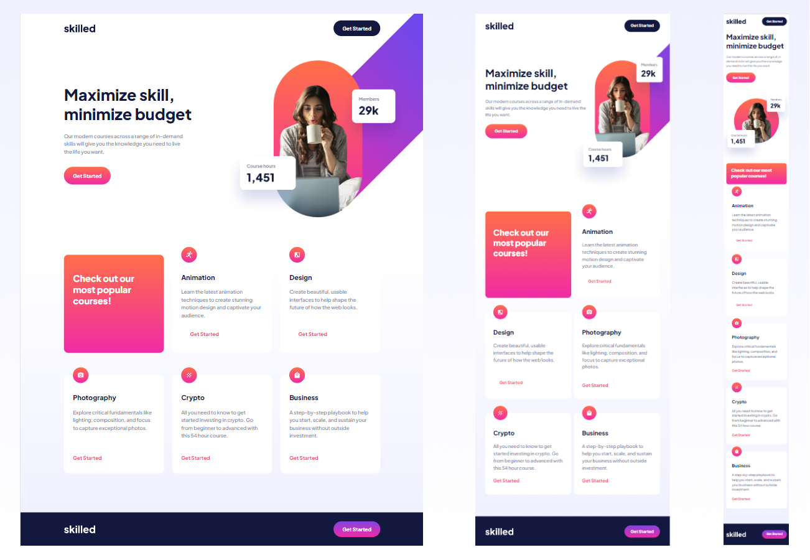

##Skilled e-learning landing page solution

This is a solution to the [Skilled e-learning landing page challenge on Frontend Mentor](https://www.frontendmentor.io/challenges/skilled-elearning-landing-page-S1ObDrZ8q).

## Table of contents

- [Overview](#overview)
  - [The challenge](#the-challenge)
  - [Screenshot](#screenshot)
  - [Links](#links)
- [My process](#my-process)
  - [Built with](#built-with)
  - [What I learned](#what-i-learned)
- [Author](#author)

**Note: Delete this note and update the table of contents based on what sections you keep.**

## Overview

### The challenge

Users should be able to:

- View the optimal layout depending on their device's screen size
- See hover states for interactive elements

### Screenshot

### Links

- Solution URL: [Repository here](https://github.com/DHolets99/skilled-landing-page)
- Live Site URL: [Live site here](https://dholets99.github.io/skilled-landing-page/)

## My process

### Built with

- Semantic HTML5 markup
- CSS/CSS3
- Flexbox
- CSS Grid

### What I learned

I improved my skills:
 - Responsive layout
 - Element positioning
 - Grid CSS
 - Flexbox

## Author

- LinkedIn - [@Darya Holets](https://www.linkedin.com/in/dholets99/)
- Frontend Mentor - [@DHolets99](https://www.frontendmentor.io/profile/DHolets99)
- CodeWars - [@Darya H](https://www.codewars.com/users/Darya%20H)

